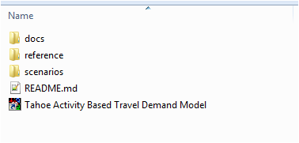
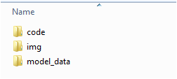
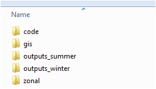

In this webpage the folder structure of the Tahoe AB model is described. It has details on where different inputs, codes, executables and output files resides. 

# Root Folder

```{r, out.width = "300px",echo=FALSE}

```


The root folder is the top level folder of the Tahoe model instalation. This folder has three sub-folders:

* docs - this folder contains the documentation for the model. All the RMarkdown scripts and the associated HTML pages are stored in this folder, along with figures and images used in creating the web pages. The HTML pages have a corresponding page in the Github website also.

* reference - this is the main folder that contains all the programs, scripts, parameters and input data (that ar enot scenario specific)

* scenarios - this is the folder that contains the scenario folder. Each scenario should have it's own sub folders. Each scenario sub-folder in the scenario folder originally contains scenarios specific inputs and place holder folders for outputs. Once the model has been run the scenario sub-folder will also have the output files for the specific scenario.


# Reference folder

```{r, out.width = "300px",echo=FALSE}

```

This folder has three sub folders. The *code* folder has all the Java programs, Python executables, and Transcad GISDK scripts/UI files. The *img* folder stores the image icons used in the Transcad UI. The *model_data* folder has the model parameters and models inputs (that are not scenario specific). The contats of each of these sub-folders will be explained in the following sub-sections.

## Code folder


## Model_data folder


# Scenarios

```{r, out.width = "300px",echo=FALSE}

```

This folder is the folder that has scenario specific inputs and scenario outputs (once the model has been run). Each scenario has it's own sub-folder. Both summer and winter for a particular scenario is stored in a the same scenario specific sub-folder.

Each scenario folder has following five sub-folders:

* code

* gis

* outputs_summer

* output_winter

* zonal

The GIS, outputs (structure is same for both outputs_summer and outputs_winter) and zonal folders will be described in the next sub-sections.

## GIS folder

Outputs folder description

## outputs folder

GIS folder description

## zonal folder

Zonal folder description

