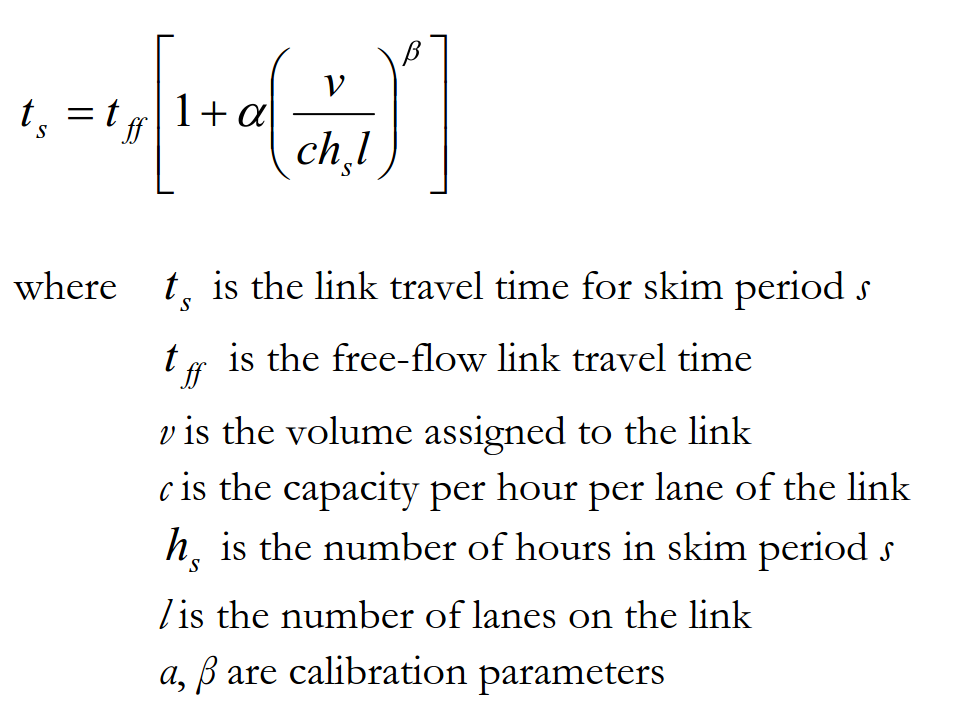
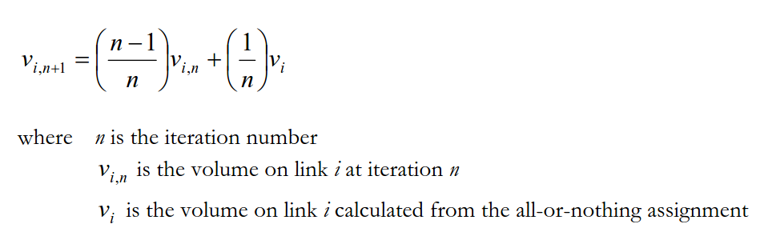

# Introduction

Once the resident, external worker, and overnight, day, and thru-visitor models have run, then all of the person tours are transformed into zone-to-zone trip tables that are assigned to the Tahoe highway network. The assignment, performed for each skim period, is done using TransCAD transportation software. The skim periods are defined in the table below.

-------------------------------------------------------------------
Skim                Start             End Time       Duration        
Period                 Time                                    
------------------- ----------------- -------------- ------------- 
AM Peak (AM)         7:00 AM          10:00 AM       3 hours 
 
Midday (MD)         10:00 AM          4:00 PM        6 hours 
 
PM Peak (PM)         4:00 PM          7:00 PM        3 hours 
 
Late Night (LN)      7:00 PM          7:00 AM        12 hours

----------------------------------------------------------------------------------
: Skim period definitions

# Trip Synthesis

After all of the tour models have finished, trips must be synthesized from the individual tours. Each leg of a particular tour counts as one trip from the origin to the destination, unless there was a stop on that leg, in which case there is a trip from the origin to the stop, and a trip from the stop to the destination. The trip information is sorted according to skim period and mode and is stored in separate TransCAD trip tables. When performing the traffic assignment, only the drive-alone and shared auto modes are assigned. The drive-to-transit, walk-to-transit, transit and the non-motorized trips are not assigned to the network because there are so few of them that their impact on traffic totals are negligible.

The street network is built from a TransCAD line and node layer. The node layer is a representation of the street intersections and TAZ nodes, while the line layer is a representation of the streets. The streets are broken into to
following functional classifications:

* Principle Arterials

* Minor Arterials

* Collectors

* Centroids

For each of these functional classifications, the following capacity per lane per hour values are assigned:

------------------------------------------------------
Functional Class          Capacity per Lane per Hour  
------------------------- ----------------------------
Principle Arterial              1100                  
                                                      
Minor Arterial 		            800                   
                                                      
Collector 			            500                   
                                                      
Centroid 			            9999                  
------------------------------------------------------
: Capacity values by functional class

In addition to this, the number of lanes and the speed limit of each link are recorded in the network. From the latter, a free flow travel time is determined for each link by taking the time it takes to traverse the link at its speed limit times a "travel-time multiplier." The travel-time multiplier is initially set to one, but was changed for some links during validation to help match observed counts. Also associated with each link is a volume-delay function (VDF), which is used in the actual traffic assignment procedure. The VDF provides a travel-time for each link given its free-flow travel time, capacity, and assigned volume.


```{r, out.width = "450px",echo=FALSE}

```

A different value for $\alpha$ and $\beta$$ are used for each link depending on its speed limit, number of lanes, and urban-type location (see Appendix I[TODO TODO] for a discussion of the urban type definitions). These values are summarized in the following table:

------------------------------------------------
 Area Type  Speed     Lanes   $\alpha$   $\beta$
			Limit		  
---------- ------ --------- ---------- ---------
Rural      60          2+       0.09      6

Rural      55          2+       0.08      6

Rural      50          2+       0.07      6

Rural      45          2+       0.07      6

Rural      35          2+       0.92      5

Rural      25          2+       1.10      5

Rural      Any         <2       0.34      4

Suburban   55         Any       0.33      4

Suburban   50         Any       0.34      4

Suburban   45         Any       0.42      5

Suburban   40         Any       0.38      5

Suburban   35         Any       0.96      5

Suburban   30         Any       1.11      5

Suburban   25         Any       1.20      5

Suburban   20         Any       1.25      5

Suburban   15         Any       1.30      5

Urban      50         Any       0.74      5

Urban      45         Any       0.72      5

Urban      40         Any       0.70      5

Urban      35         Any       1.00      5

Urban      30         Any       1.20      5

Urban      25         Any       1.30      5
---------------------------------------------------
: BPR function coefficients specifications


# Traffic Assignment

A traffic assignment is performed for each skim period, using the trip tables generated during trip synthesis. The assignment type is capacity restraint, meaning that all of the trips between two zones are iteratively assigned to the shortest calculated path by time (all-or-nothing assignment). For each iteration, link volumes are updated by the following (MSA) method:

```{r, out.width = "500px",echo=FALSE}

```

From these link volumes, new link travel times are computed, and the traffic is re-assigned. This procedure is continued until the average change in link volumes becomes very small. This assignment method is guaranteed to converge. During model development, a convergence criterion of 0.0001 was used, and it was found that a maximum of 50 iterations was needed to reach convergence.


# Skims

Once trips have been assigned to the street network, skims can be produced. Skims are matrices of values giving travel time and cost components between zones for a set of modes. For the Tahoe model, three main sets of skims are produced: highway (street) skims, transit skims, and walk skims. These skims are used throughout the model for such things as calculating accessibilities and destination, time-of-day, and mode choice determinations. The walk skims are simply a zone-to-zone shortest distance matrix using 3 miles/hour as the walk speed. These do not require the traffic assignment results. For highway skims, the shortest path by time as determined during the traffic assignment results is stored.

Transit skims are somewhat more complicated. For full details, see Travel Demand Modeling with TransCAD 4.8. Briefly, the transit skimming procedure determines the shortest path between two zone using transit modes. There is a separate skim for walk-to-transit and drive-to-transit modes. For the former, the access to the transit is by walking from the origin zone to the (usually closest) transit stop; for the latter, the access to the transit is determined by driving to a qualifying transit stop. A qualifying stop is often a park and ride lot but for the Tahoe basin, because of the transit and street layout, all transit stops were considered qualified. In the transit skim, transit transfers are allowed, and access from the final transit station to the destination zone is always made by walking.

For each transit skim, a number of matrices are produced:

* Transit access time (time from origin to transit stop)

* Transit in-vehicle time (time in transit vehicle)

* Transit egress time (time from final transit stop to destination)

* Transit headway wait times

* Transit transfer times

* Transit fare costs

The fare matrix can be translated into time units using an appropriate value of time (which varies across model segments).
