# Chapter 1. Introduction

This chapter introduces the Tahoe Activity-Based Travel Demand Model. It will briefly discuss the model
components, as well as the user interface. It is by no means intended as a definitive guide to the details of
the model; for that, see The Tahoe Activity Based Travel Demand Model Documentation.

## The Tahoe Activity Based Model

The Tahoe Activity Base Travel Demand Model (from here on referred to as Tahoe AB Model) is a travel
demand model developed for the Lake Tahoe basin region for the Tahoe Regional Planning Agency
(TRPA). It is a micro-simulated, activity-based model which can be used to generate traffic projections
for present-day and future scenarios for both summer and winter seasons. The model components can be
briefly described as follows:

* *Resident Model* - This covers the population that lives full-time within the Tahoe basin region. This
model includes:

    + A population synthesizer that microsimulates a resident population which matches the income, household size, and worker distributions of the region.

    + A daily activity pattern model which determines the broad travel patterns for every person in the
population.

    + Tour generation models to determine the number, type, and participation in joint and individual tours.

    + Destination, time-of-day, and mode choice models for every tour made by the population.

    + Tour stop generation, destination, and mode choice models for every tour made by the population.

* *External Worker Model* - This covers the people who live outside of the Tahoe basin region, but work
within it. This model includes:
    + A population synthesizer to microsimulate the external workers needed to fill the employment in
the region.

    + An origin choice model to determine which external station the workers orginated from.

    + A time-of-day choice model for the external worker tours.

* *Visitor Model* - This covers all of the people who come to visit the Tahoe basin region or live within
it on a seasonal basis. This model includes:

    + Population synthesizers for overnight, day, and thru visitor populations. These synthesizers are indexed to the vacancy rate at hotels, campgrounds, and other visitor accomodations.

    + Pattern choice models which determine the number and type of tours and stops made by the overnight
and day visitor populations.

    + Destination, time-of-day, and mode choice models for each of the tours and stops made by the
overnight and day visitor populations.

* *Traffic Assignment Model* - This model collects the results of the resident, external worker, and visitor
models and assigns them to the Tahoe street network. The assignments are broken into four skim periods:

    + AM Peak - 6:00 AM - 9:00 AM

    + Midday - 9:00 AM - 3:00 PM

    + PM Peak - 3:00 PM - 6:00 PM

    + Overnight - 6:00 PM - 6:00 AM
  
## The User Interface

The access to the Tahoe AB Model is made through the TransCAD user interface. This interface provides control over creating and editing model scenarios, running the model for scenarios, and viewing and analyzing the model results. In theory, the user should be able to access everything related to the Tahoe AB Model through this interface. The remainder of this document will primarily focus on how to set up and use the model via the user interface.  

# Chapter 2. Installation

This original model came with an installer; however, going forward the installation will be "plug and play" and an installer will not be necessary. Users will be able to run the model directly after dowloading from Github. The contents below will be revised once the model is updated later in the project.  

* In the chosen installation directory, a new directory is created: TahoeModel/. Within this directory,
the following subdirectories and files are created:

* A reference/ directory, which includes all of the model application code and related fixed files. This includes, but is not limited to, Java code used to run a majority of the model, and the GISDK code used to run the user interface. Also included are model specification files, image files, and the base scenario.

* A scenarios/ directory, which will include all of the scenario specific files and data.

* A documentation/ directory, which includes all of the documentation related to the model.

* A program shortcut to quickly start the model's user interface.

* If requested, shortcuts to quickly start the model interface will be created in the following places:

> * In a program group in the user's Start Menu.

> * On the user's desktop.

* If requested, the model is added to the TransCAD "Add-Ins"; the installer will add a required line of
text to the Add-ins.txt file located in the TransCAD installation directory.

* A TahoeModelRunnerBackup.txt is created in the TransCAD installation directory. This file contains the basic setup information used to load the user interface in the correct state.  

* To uninstall the Tahoe AB Model, the installation actions described above should be reversed. Specifically, all created files and directories should be deleted and the relevant line in Add-ins.txt should be removed (if necessary). An automatic uninstaller is not provided as it may be desirable to save certain data (e.g.  the scenarios/ directory). Also, an automated uninstaller might create the possibility of unintentionally deleting important data.

# Chapter 3. User Interface: Overview

This chapter will introduce the user interface for the Tahoe AB Model. It will discuss its basic features and functions.
The User Interface, as it appears when it is first opened, is shown in Figure 3.1 below. It consists of two main sections, the scenario control section and the model control section, which is broken up into multiple tabs. These sections and tabs will be discussed in the succeeding chapters. This chapter will deal with the the overall interface control.  

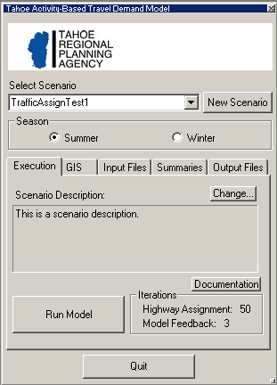

Note: If the Tahoe AB Model user interface is being run for the first time, then the following warning
may appear:  

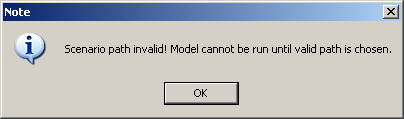

This does not signal an error, it is merely indicating that no scenarios have been set up yet. To
avoid seeing this message again, create at least one new scenario as described in Chapter 4,  User
Interface: Scenario Control and Execution Tab.  

_General User Interface Controls_  
There are only a few general controls for the user interface. The first of these is the minimizing
button. This is the white section at the top of the interface with the TRPA logo. Pressing on this button will
minimize the interface, so that it looks like the picture in Figure 3.3, "The Minimized Tahoe AB Model
User Interface". Pressing this button when the interface is minimized will open it to its full size again.

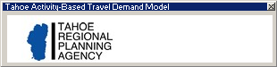

The other general control is the Quit button. This closes the interface, as well as any open maps, matrices,
or other TransCAD files. It also performs important cleanup operations. Alternatively, the button in the
upper right hand corner of the interface may be pressed. If TransCAD is closed before exiting the interface,
then the cleanup operations will not be performed and the interface may be in an invalid state
the next time it is opened. Though this should never break the interface, it may be left in a state that will
not reflect recent changes to scenarios and/or data. Therefore, it is emphasized that **the interface should always
be closed _before_ closing TransCAD so as to ensure that it is always in a valid and current state**.

# Chapter 4.  User Interface: Scenario
_Control and Execution Tab_  
This chapter will present the scenerio control section, as well as the user interface Execution tab. These
collectively control the selection and creation of scenarios, as well as execution of the model.  

The Scenario Control Section  
The scenario control section is shown in Figure 4.1, "The Scenario Control User Interface Section".
This section controls the creation and selection of scenarios for use in the model control section. The first
element of this section is the Select Scenario popdown menu. This menu contains the names of all of the
created scenarios. When a particular scenario is selected, this indicates that all of the subsequent controls
from the model control section will refer to this scenario. A scenario may be changed at any time during
the interaction with an interface; there is generally no chance of internal conflicts when changing scenarios
while performing different model control operations. The only exception to this is saving maps, which is
discussed in _Warning: Saving Maps to Current Scenario_.  

Below the scenario selection menu is the Season selection box. The selection of Summer or Winter indicates which season the model control section operations will refer to. Each scenario is bi-seasonal, meaning it can model both summer and winter seasons. Model inputs and outputs concerning each season are held separately, so model information and results can be independently accessed. This minimizes data redundancy and potential confusion concerning scenarios.  

To the right of the scenario selection menu is the New Scenario button. This button allows the user to
create a new scenario. Upon pressing this button, the popup window shown in Figure 4.2, "The Create
New Scenario Popup Window" will appear. This window allows the user to type in a scenario name,
as well as an optional description of the scenario. Pressing the OK button will create the scenario, while
pressing the Cancel button will exit the dialogue without creating a scenario.

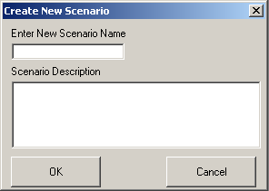

A few things concerning the scenario creation procedure are worth noting:

* When a new scenario is created, it becomes the current scenario (and is reflected so in the Select Scenario
menu).

* Only one scenario with a given name is allowed. So, if trying to create a scenario with a name previously
used, then an error message will be shown and the scenario will not be created. Scenario names are
not case-sensitive (though their typed casing will be preserved in the user interface); this means that a
scenario named "test" is identical to one named "tEsT". In addition to this, the overlap of names is subject
to the following constraints:

* Spaces may be used in the scenario name; however, they will be (internally) converted to underscore
characters ("_"). Also, because a scenario gets represented on disk as a physical folder, characters not allowed
in folder names are also not allowed in scenario names. Examples of such characters are "*" and "%."

* There is no limit on the length of the scenario name and/or description; however, the space provided
in the text entry boxes should generally not be exceeded. If the name or description extends beyond the
allotted space, then there is a good chance that the name or description will extend beyond the bounds
of the user interface controls. While this will not affect the user interface's operation, it may make it
difficult to use because the scenario information will get cropped.  

_The Execution Tab_
The Execution tab is shown in Figure 4.3, "The Execution Tab". It consists of a section which displays
the scenario description, as well as a model execution control. The Scenario Description text box shows
the description for the currently selected scenario. When the current scenario is changed, the description
changes to correspond to the new one.

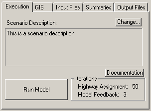

If the user wants to change the scenario description, then pressing the Change button will bring up the
following popup box which will allow the user to edit the current scenario description:  

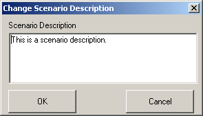

The "Documentation" button allows the user to view documentation from the user interface. Pressing this
button will open a popup window from which the model documentation can be opened in various formats.
This guide, as well as The Tahoe Activity Based Travel Demand Model Documentation, are available to
the user.  

The "Run Model" button starts the Tahoe AB Model. The box next to the button gives a summary of the
model iteration parameters. The Highway Assignment value gives the maximum number of iterations for
each highway assignment procedure. The Model Feedback value gives the number of feedback iterations
for the model. Each feedback iteration will run the entire model, using skims generated from the previous
feedback iteration's highway assignment. The highway assignment and feedback iteration values have
been fixed based on testing carried out during model development.

Once the model is started, it cannot be stopped until it is finished. There will be "flashing" on the screen
as both TransCAD and Java routines are executed. Depending on the computer configuration, the entire model run should take between 2.5 and 6 hours to run. There is no "status" indicator, so the current state of
the model run can not be discerned. The model run is complete when TransCAD and the user interface are
responsive again. If network and/or other geographic changes have been made to the scenario, then it is
possible that a TransCAD popup window will appear indicating that a layer or network has been updated
to reflect the changes. If this happens, just click the OK button to allow the model to continue. If a model
run is accidentally stopped by force (for example by a power outage) then that model run must be re-run.  

It is possible to run the model more than once for a given scenario and season combination. However, only
the results of the last model run for a given season and scenario will be retained. If the model is run more
than once for a scenario and season, then the previous model results will be deleted permanently. Because
of this, attempting to run the model more than once will cause a warning popup window to display which
asks the user to confirm that re-running the model is truly desired.

# Chapter 5.  User Interface: GIS Tab

This chapter will present the Tahoe AB Model user interface GIS tab. This tab allows the user access to
scneario-specific geographic data and mapping functionality.

_The GIS Tab_
GIS stands for Geographic Information Systems. GIS programs allow geographic information to be analyzed and presented in a powerful way. TransCAD is an example of a GIS program. The GIS tab allows the geographic data associated with the Tahoe AB Model scenarios to be viewed, edited, and analyzed in a straightforward way. The GIS tab is shown in Figure 5.1, "The GIS Tab". Its functionality can be split
into two segments: saving and opening maps, and generating colored data mappings. These segments
will be discussed in the following sections.

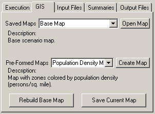

_Opening and Saving Maps_  
TransCAD maps provide the basic interface with which geographic data can be accessed and analyzed. The
"Saved Maps" popdown menu provides a list of all previously saved maps that are available to be opened.
Saved maps are scenario specific, so when the current scenario is changed, the list of available maps will
also change. Each saved map may have a description, which is displayed in the Description text box. To
open a previously saved map, select the desired map from the Saved Maps menu and press the Open Map
button. Unless the map is explicitly closed by the user, the map will remain open until the user interface
has been closed.

All scenarios have a Base Map map available to open. When opened, it will look something like Figure 5.2,
"The Base Map".

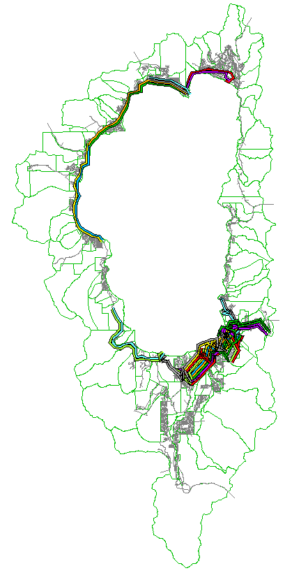

This map provides the basic access point to all the available model geographic data. By default, this map
shows the TAZ boundary, the street network, and the transit line layers. The base map also contains the
following information and geographic objects:  

* Point layers which describe the street network nodes, the transit stops, and the physical transit stops.
The difference between a regular and physical transit stop is the former corresponds to an actual street
network node, whereas the latter corresponds to the actual physical location of the stop.

* A street network node selection set which describes which nodes are centroid points.

* A series of transit layer selection sets which describe in which skim periods and seasons each transit
line runs.

While a map is open, it can be edited and colored as the user pleases. To save the current map (the one
whose window is on top), press the Save Current Map. This will bring up the following popup box:

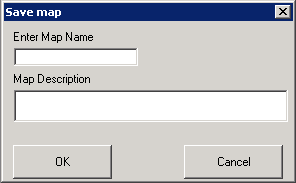

This box allows the user to enter a name for the map, as well as a description. If a map already exists by that
name, then the user will be prompted to ensure that overwriting the previously saved map is desired. Once
a map is saved, it is added to the Saved Maps menu. A few items concerning saving maps are worth noting:

* Map names are not case-sensitive (though their typed casing will be preserved in the user interface); this
means that a map named "test" is identical to one named "tEsT". In addition to this, the overlap of names
is subject to the constraints in the following item.

* Spaces may be used in the map name, however, they will be (internally) converted to underscore
characters ("_"). 

* There is no limit on the length of the map name and/or description. However, the space provided in
the text entry boxes should generally not be exceeded. If the name or description extends beyond the
allotted space, then there is a good chance that the name or description will extend beyond the bounds
of the user interface controls. While this will not affect the user interface's operation, it may make it
difficult to use because the map information will get cropped.

* Often maps contain season-specific coloring and/or information. Because of this, it is recommended
that a season specifier be added to the map name and description for any map that has season-specific
elements. e.g. a map with the streets colored by the winter AM volumes might be named "Volume AM
Winter" instead of "Volume AM".

* Because the base map is central to the correct operation of the Tahoe AB Model, the model can be
extremely sensitive to changes to it. Because of this, saving a map with the name Tahoe is not allowed
(the base map's physical file is called Tahoe.map). Furthermore, when the base map is opened from
the user interface, it is actually a copy of the base map that is opened, so that using TransCAD's save
functionality directly will not overwrite the base map file. Sometimes, however, it is necessary to have
base map changes, so this functionality is provided through a separate interface described in the section
called "Rebuilding the Base Map".

* To change the description of a previously saved map, simply open that map, and then re-save it with the
same name but using a different description.  

**Warning: Saving Maps to Current Scenario**
When a map is saved, it is saved with respect to the currently selected scenario, not to the scenario
under which it was originally opened. For example, if a map opened in _scenario A_ is saved when
_scenario B_ is the current scenario, then the map is added to scenario B's map list, not scenario A's,
even though the map refers to scenario A's information. Thus, it is imperative **when saving a map
that the scenario corresponding to that map is selected as the current scenario**.  

It is also worth noting that a map may be saved through the typical TransCAD interface. *Saving maps in
this manner is discouraged*. The map will not be listed in the Saved Maps menu, and accessing it through
the user interface will not be possible.  

_Rebuilding the Base Map_  
Generally, the base map should not be changed. However, in the case that transit lines have been added to
the scenario, then the transit season and time-period selections need to be recalculated. This can be done
by rebuilding the base map. Also, if the base map is accidentally altered, then it can be rebuilt to bring
it back to it original (correct) state. To rebuild the base map, simply press the "Rebuild Base Map" button
located at the bottom of the GIS tab. The user will be prompted to confirm that rebuilding the base map is
desired, and if that prompt is answered in the affirmative, then the base map will be rebuilt.  

_Generating Pre-Formed Maps_
The GIS tab includes the functionality to generate "pre-formed" maps. Through this functionality, a series
of defined map themes can be generated automatically via the user interface. The Pre-Formed Maps menu
contains a list of all available pre-formed maps. Highlighting any of these will cause its description to be
displayed in the Description text box below the menu. To generate the selected pre-formed map, press the
Create Map button. Depending on the pre-formed map selection, a popup box may be displayed offering
more granularity in the generated map. For all of the maps, the following dialogue window will popup:

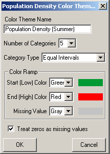

This window gives the user control over the specifics of the pre-formed map theme. At the top of the
window is a Color Theme Name text entry box for the theme's name. Beneath that is a control for the
number of color categories used in the theme as well as the method used to generate the categories. Three
category generator types are available, derived directly from TransCAD's built in functions:

1. Equal Intervals - the numerical distance between each category interval cutoff is identical.  

2. Equal Feature Count - the number of items in each category is identical.  

3. Categories - one numerical value per category; only the most frequently found categories (up to the
category limit) are shown.  

Underneath the category control is a section which allows the user to control the theme's color ramp: each
map feature will be colored according to its category placement, with the color gradually shifting from the
Start to the End color. Missing value colors can be specified separately. Lastly, the option to treat zeros
as missing values is provided.  

After a pre-formed map is created, the user can choose to save it as described previously or close it (either
explicitly or by closing the user interface). An example of a pre-formed map is shown in Figure 5.5, "An
Example of a Pre-Formed Map of Population Density", which is a population density map created with
five Equal Intervals categories. The map was created using the base year summer socio-economic data.

# Chapter 6.  User Interface: Input Files Tab

This chapter will present the Tahoe AB Model user interface Input Files tab. This tab allows the user access
to model data files which may change between scenarios.  

_The Input Files Tab_
There are a number of non-GIS files which may change between scenarios. Access to these mutable input
files is provided through the Input Files tab, which is shown in Figure 6.1, "The Input Files Tab".

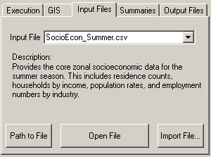

The Input File menu provides the list of input files available to the user. This list will be different depending
on the current season selection, which allows for seasonal variation among model scenarios. Selecting a
particular input file in the menu will cause a description of that particular file to show up in the Description
text region. For more details concerning specific input files, the user is referred to the The Tahoe Activity
Based Travel Demand Model Documentation.

Once an input file is selected the user can open the file by pressing the "Open File" button. As all of the
files are comma-separated value (.csv) files, they will be opened in the program associated with them
(usually Microsoft Excel, if it is installed). The file can then be edited and saved through the application
that it was opened in.

If the user would like to see the absolute path to the input file, then pressing the "Path to File" button will
display this.  

When a scenario is created, the input files it starts with are those for the base year (2005) scenario. It is
possible that a particular scenario will have input files that are identical to another scenario's, but not the same
as the base scenario. For example, the user may have spent the time to edit the input files for a base 2010
scenario. If the user then creates a 2010 scenario which will have the same transit line layout from the
2005 base, the GIS data will not change, but the input files will be different. To facilitate such cases, the user
interface allows the user to import an input file from one scenario to another. Once a particular input file has
been selected in the Input File menu, pressing the Import File button will bring up the following window:

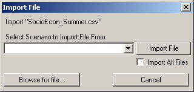

In this window, using the "Select Scenario to Import File From" popdown menu, the user may choose a
scenario to import the file from. Alternatively, the "Browse for file..." button allows the user to browse for
the file. Only a file whose name is the same as the input file may be imported. If the user would like to
import all of the input files from one scenario to another, then selecting the "Import All Files" checkbox
before pressing the Import File button will import all of the input files (including summer and winter
seasons) from the chosen scenario to the current one. All of the methods used to import an input file
will permanently overwrite the current scenario's input file(s). Because of this, when the user chooses to
import an input file, a warning window pops up forcing the user to confirm the file import.

# Chapter 7.  User Interface: Summaries Tab

This chapter will present the Tahoe AB Model user interface Summaries tab. This tab allows the user access
to model summaries.  

_The Summaries Files Tab_  
After a model run has completed, a whole host of options are available for the user to analyze the results.
The pre-formed mapping functionality discussed in the section called "Generating Pre-Formed Maps"
allows some graphical analysis, and the actual outputs can be viewed using the Output Files tab. The
Summaries tab, which allows the user to see summary reports based on the model outputs, will be discussed
here. A picture of the Summaries tab is shown in Figure 7.1, "The Summaries Tab".

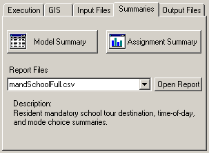

_Model and Assignment Summaries_
Two sets of summaries available to the user from the Summaries tab are _model_ and _traffic assignment_
summaries. Both of these summaries are text based and are opened in a simple text viewer program. This
program allows the summary to be printed, saved, or saved as a comma-separated values (.csv) file - which
can be opened in Microsoft Excel. This allows the user to analyze the summaries outside of the bounds
of the TransCAD user interface.  

_Model Summaries_
The model summaries provide tables which summarize the model run results across a variety of dimensions. The summaries are as follows:
* Resident Model
> * Household income by household size
> * Household income by workers in household
> * Household size by workers in household
> * Tour type by tour mode
> * Tour type by start skim period
> * Tour type by end skim period
> * Tour type by tour stops
> * Tour type by external destination station  

* External Worker Model
> * Entrance external station by start skim period
> * Entrance (exit) external station by end skim period  

* Overnight Visitor Model
> * Stay type by travel party size
> * Stay type by tour type
> * Tour type by tour mode
> * Tour type by start skim period
> * Tour type by end skim period
> * Tour type by tour stops  

* Day Visitor Model
> * Entrance external station by travel party size
> * Entrance external station by tour type
> * Tour type by start skim period
> * Tour type by end skim period
> * Tour type by tour stops  

> * Thru Visitors Model
> * Entrance external station by exit external station  

_Assignment Summaries_
The assignment summaries provide tables of total vehicle-miles traveled (VMT) and total vehicle-hours
traveled (VHT) stratified by link type and skim period. The link types are as follows:  
* Principal Arterial
* Minor Arterial
* Collector
* Centroid

and the skim periods are:

* AM Peak - 7:00 AM - 10:00 AM
* Midday - 10:00 AM - 4:00 PM
* PM Peak - 4:00 PM - 7:00 PM
* Overnight - 7:00 PM - 7:00 AM

In addition to these stratifications, VMT and VHT summaries for the entire day and for all link types
together are reported in the summary.  

_Report Files_
During the calibration stage of the Tahoe AB Model development, a number of summary report files were
developed to aid in that effort. These report files offer a variety of summaries for each model component,
including tour type, distance, time-of-day, and mode choice summaries. While these reports are not very
"polished," they may be of interest for the user, so they are made available through the Summaries tab. The
user may select a report file from the Report Files menu, which will cause a description of the report to be
displayed in the Description text box. Pressing the "Open Report" button will open the selected report. All
of the reports are comma-separated values (.csv) files, and will open with the program associated with
such files (usually Microsoft Excel, if it is installed).

# Chapter 8.  User Interface: Output Files Tab

This chapter will present the Tahoe AB Model user interface Output Files tab. This tab allows the user
access to the output files produced during a model run.  

_The Output Files Tab_
During a model run, a number of files are produced. Often, the user will only want to see summaries of
the model results, in which case the functionality present in Chapter 7, User Interface: Summaries Tab. However, if a greater level of model detail is desired, the actual model output files present all of the information available from the model run. Access to these model output files is provided in the Output Files tab, which is shown in Figure 8.1, "The Output Files Tab".

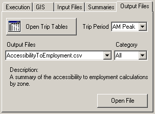  

One of the most important model outputs for a user are the zone-to-zone trip tables. Pressing the "Open
Trip Tables" button opens the trip table corresponding to the Trip Period menu selection. The available trip periods
are the model skim periods:

* AM Peak - 7:00 AM - 10:00 AM
* Midday - 10:00 AM - 4:00 PM
* PM Peak - 4:00 PM - 7:00 PM
* Overnight - 7:00 PM - 7:00 AM  

Each trip table opens as a TransCAD matrix view. Each matrix view contains a number of matrices, or
"cores," corresponding to different modes. The mode cores are:  

* Drive Alone - auto trips with no passengers
* Shared Auto - auto trips with one or more passengers
* Visitor Shuttle - visitor trips on a shuttle bus
* Walk to Transit - transit trips in which the person walked to get to the transit line
* Drive to Transit - transit trips in which the person drove to get to the transit line
* Non-Motorized - trips usind non-motorized transportion: walk, bicycle, skateboard, etc.
* School Bus - (school) trips using a school bus
* Total Drive Trips - Drive Alone plus Shared Auto; these are the trips actually assigned during highway
assignment

The opened matrix view has its rows and columns indexed according to the TAZ numbers they correspond
to. If the matrix is to be mapped, then it might be necessary to use the native TransCAD TAZ layer id
values to index the matrix. This index is included in the view under the name Nodes.  

Access to the other model output files is provided in the Output Files menu interface. Selecting a file in this
menu causes a short description of it to appear in the Description text region below the menu. Pressing the
"Open File" button opens the selected file. A majority of the files are comma-separated values (.csv) files,
which will be opened in the program associated with them (usually Microsoft Excel, if it is installed). A
few of the files are TransCAD fixed-format binary files (.bin) and are opened in a TransCAD dataview.
Lastly, the event.log file, which is a text file, is opened in a simple text viewer program.

The large number of available output files to view (almost 40) can make searching for and selecting a file
to view rather unwieldy. To help with this, the interface allows the user to select from a subset of output
files, based on categories. Selecting a file group from the Category menu will cause the Output Files to
only show the files which pertain to that category. The available categories are:

* Zonal - output files which pertain to the zonal geography
* Resident - output files specific to the resident model
* External Worker - output files specific to the external worker model
* Visitor - output files specific to the visitor model
* Assignment - output files specific to the highway assignment
* Logs - log files created during the model run
